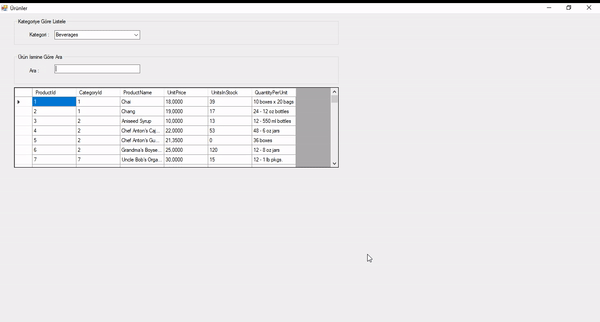

# products-list
MSSQL bağlantısıyla database üzerinde kayıtlı ürünlerin listelenmesi, aranması. ORM aracı olarak Entity Framework(EF) kullanılmıştır.(Listing and searching the products registered on the database with MSSQL connection. Entity Framework(EF) is used as ORM tool)

